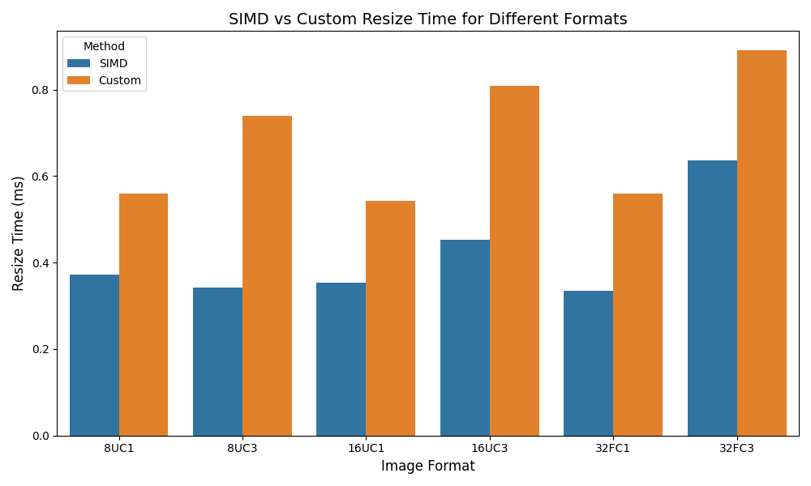

# Image Resizing Library Documentation

**Author:** Lizhuo Luo, Jiachen Zhou

**Email:** <12111925@mail.sustech.edu.cn>

**Date:** 2025-01-09

---
## Introduction
This document provides a comprehensive overview of the components of the image resizing library. 

This project realizes the image resizing function based on OpenCV. We develop the library with the following goals:

1. Support different interpolation methods, including **Nearest Neighbor Interpolation** and **Bilinear Interpolation**. Any ratio of the width and height is supported, whatever **amplification** or **shrinking** is supported.
2. Support different data type for both **Nearest Neighbor Interpolation** and **Bilinear Interpolation**, including **8UC1**, **8UC3**, **16UC1**, **16UC3**, **32FC1**, **32FC3**.
3. Support multithreading for both **Nearest Neighbor Interpolation** and **Bilinear Interpolation**. Use OpenCV's `cv::parallel_for_` to implement the multithreading.
4. SIMD optimization for **Nearest Neighbor Interpolation** Only. Use AVX2 instructions 256 bits registers based on the multithreading infrastructure provided by OpenCV, `cv::parallel_for_`. You will define the **`USE_AVX2`** automatically if your device support AVX2 instructions.
5. Reach **`TEST` mode** by adding **`-DTEST`** in the cmake command. And we use macros to manipulate the different mode and hardware acceleration. 

The design of Codebase is based on the [OpenCV's design](https://github.com/opencv/opencv/blob/4866811933ac9d188fe098308fb34112de296992/modules/imgproc/src/resize.cpp#L1121-L1172), and the SIMD optimization is based on the Intel's [AVX2 instructions](https://www.intel.com/content/www/us/en/docs/intrinsics-guide/index.html#avxnewtechs=AVX2). We open-source the project on github: https://github.com/lizhuo008/resize_func.git


### Dependencies

Before building or running this project, ensure the following requirements are met:

- **CMake >= 3.10:**
Required for configuring and generating build files.

- **C++ 11:**
Ensure your compiler supports at least the C++11 standard.

- **OpenCV >= 4.6.0:**
Used for image processing tasks; this exact version is required for compatibility. Follow the instructions below to install OpenCV.

  ```bash
  sudo apt-get install libopencv-dev
  ```

### Quick Start

```bash
git clone https://github.com/lizhuo008/resize_func.git
cd resize_func
mkdir build
cd build
cmake ..
make
./resize_func
```

### Project Structure

1. **Core Features**
   - `imgproc.hpp`: Main declarations for image resizing, implemented by `imgproc.cpp` and `simd.cpp`.
   - `imgproc.cpp`: Implementation of image resizing features.

2. **SIMD Optimizations**
   - `simd.cpp`: Specialized functions leveraging SIMD for performance.

3. **Utilities**
   - `utils.hpp`: Complementary utilities for supporting operations.
   - `utils.cpp`: Implementation of utilities.

4. **Testing**
   - `test.hpp`: Declarations for testing the library.
   - `test.cpp`: Test cases and validation for implemented functions.

---

## Main Features and Design

The main features are implemented in the `imgproc.hpp`, `imgproc.cpp` files and the `simd.cpp` file for the SIMD optimization. To support all the data types, we use template to implement the class. And Macro to manipulate the different mode and hardware acceleration. 

In this section, we will introduce the main features of this library. The final interface is `resize_custom`, and other features to implement the `resize_custom` will be briefly introduced.

### Interface: `resize_custom`

You can reach all the features of this library by this interface.

```cpp
void resize_custom(const cv::Mat& input, cv::Mat& output, const cv::Size& new_size, int interpolation);
```
- **Purpose**: The final interface of the resize function, which is the main interface for the user.
- **parameters**:
  - `input`: The input image.
  - `output`: The output image.
  - `new_size`: The new size of the image.
  - `interpolation`: The interpolation method. **`cv::INTER_NEAREST`** or **`cv::INTER_LINEAR`**.

### File: `imgproc.hpp`

Declare the main features of resize function, implemented in `imgproc.cpp` and `simd.cpp`.

##### Class: `resizeNNInvoker_custom`

This class performs parallelized nearest-neighbor interpolation using OpenCV's `cv::parallel_for_`. This class parallel the independent rows of the image. Each thread will deal with a specific row of the image. The mapping at x axis is already computed before the parallel computing and stored in `x_ofs`. Design of **template** is used to support different data types and channels. We use `cv::parallel_for_` to implement the multithreading.

```cpp
template <typename T>
class resizeNNInvoker_custom : public cv::ParallelLoopBody
{
    public:
    resizeNNInvoker_custom(const cv::Mat& _input, cv::Mat& _output, const cv::Size& _inp_size, const cv::Size& _out_size, int* x_ofs, double _ify);

    void operator()(const cv::Range& range) const CV_OVERRIDE;

    private:
    const cv::Mat& input;
    cv::Mat& output;
    const cv::Size& inp_size;
    const cv::Size& out_size;
    int* x_ofs;
    double ify;
};
```

- **Purpose**:  
  Enables parallel nearest-neighbor interpolation.
- **Key Method**:  
  `operator()(const cv::Range& range)` processes a specific range of rows for parallel computation.
- **Attributes**:
  - `input`: The input image.
  - `output`: The output image.
  - `inp_size`: The size of the input image.
  - `out_size`: The size of the output image.
  - `x_ofs`: The x offset of the input image.
  - `ify`: The y scale factor.

##### Function: `resizeNN_custom`

```cpp
void resizeNN_custom(const cv::Mat& input, cv::Mat& output, const cv::Size& inp_size, const cv::Size& out_size, double ifx, double ify);
```

- **Purpose**:  
  Resizes an image using nearest-neighbor interpolation, invoke `resizeNNInvoker_custom` to implement the parallel computing.

##### Function: `resizeNN_naive`

```cpp
template <typename T>
void resizeNN_naive(const cv::Mat& input, cv::Mat& output, const cv::Size& inp_size, const cv::Size& out_size, double ifx, double ify);
```

- **Purpose**:  
  A simple implementation of the Nearest Neighbor interpolation for image resizing, processed sequentially without parallelism.

#### Additional Functions in `imgproc.hpp`

##### Class: `resizeBilinearInvoker_custom`

```cpp
template <typename T>
class resizeBilinearInvoker_custom : public cv::ParallelLoopBody
{
  // ...
}
```
##### Function: `resizeBilinear_custom`

```cpp
void resizeBilinear_custom(const cv::Mat& input, cv::Mat& output, const cv::Size& inp_size, const cv::Size& out_size, double ifx, double ify);
```
##### Function: `resizeBilinear_naive`

```cpp
void resizeBilinear_naive(const cv::Mat& input, cv::Mat& output, const cv::Size& inp_size, const cv::Size& out_size, double ifx, double ify);
```  
  Three blcoks above are the functions to implement the Bilinear Interpolation for image resizing, processed sequentially without parallelism. Similar to Nearest Neighbor Interpolation.

##### Function: `resize_naive`

```cpp
void resize_naive(const cv::Mat& input, cv::Mat& output, const cv::Size& new_size, int interpolation);
```

- **Purpose**:  
  A simple implementation of the resize function, processed sequentially without parallelism.

##### Function: `resize_custom`

```cpp
void resize_custom(const cv::Mat& input, cv::Mat& output, const cv::Size& new_size, int interpolation);
```

- **Purpose**:  
  A generic image resizing function supporting different interpolation methods. The final interface for the user.


### File: `imgproc.cpp`

This file contains the implementation of the core functions declared in `imgproc.hpp`.

##### Class: `resizeNNInvoker_custom`

Constructor

```cpp
template <typename T>
resizeNNInvoker_custom<T>::resizeNNInvoker_custom(const cv::Mat& _input, cv::Mat& _output, const cv::Size& _inp_size, const cv::Size& _out_size, int* _x_ofs, double _ify)
: input(_input), output(_output), inp_size(_inp_size), out_size(_out_size), x_ofs(_x_ofs), ify(_ify)
{
}
```

- **Purpose**: Initializes the object with the necessary input and output parameters.

Operator Overload

```cpp
template <typename T>
void resizeNNInvoker_custom<T>::operator()(const cv::Range& range) const
{
    // Implementation of the nearest-neighbor interpolation.
}
```

- **Purpose**: Implement the nearest-neighbor interpolation using parallel computing. The detail is parallel the independent rows of the image. Each thread will deal with a specific row of the image.

##### Function: `resizeNN_custom`

```cpp
void resizeNN_custom(const cv::Mat& input, cv::Mat& output, const cv::Size& inp_size, const cv::Size& out_size, double ifx, double ify)
{
}
```

- **Purpose**: Customed resize function with Nearest Neighbor Interpolation using parallel computing.

#### Other Implementations

##### Class: `resizeBilinearInvoker_custom`

```cpp
template <typename T>
resizeBilinearInvoker_custom<T>::resizeBilinearInvoker_custom(const cv::Mat& _input, cv::Mat& _output, const cv::Size& _inp_size, const cv::Size& _out_size, int* _x_ofs, double _ify)
: input(_input), output(_output), inp_size(_inp_size), out_size(_out_size), x_ofs(_x_ofs), ify(_ify)
{
}

template <typename T>
void resizeBilinearInvoker_custom<T>::operator()(const cv::Range& range) const
{
  // ...
}
```

##### Function: `resizeBilinear_custom`

```cpp
void resizeBilinear_custom(const cv::Mat& input, cv::Mat& output, const cv::Size& inp_size, const cv::Size& out_size, double ifx, double ify)
```
Two Implementations above are the functions to implement the Bilinear Interpolation for image resizing, processed sequentially without parallelism. Similar to Nearest Neighbor Interpolation.

##### Function: `resize_naive`

```cpp
void resize_naive(const cv::Mat& input, cv::Mat& output, const cv::Size& new_size, int interpolation)
```

- **Purpose**: This function serves as a general interface for image resizing using naive interpolation methods. It supports both nearest-neighbor and bilinear interpolation

##### Function: `resize_custom`

```cpp
void resize_custom(const cv::Mat& input, cv::Mat& output, const cv::Size& new_size, int interpolation){}

```

- **Purpose**: The final customed resize function, intergrating Nearest Neighbor Interpolation and Bilinear Interpolation.

### File: `simd.cpp`

This file provides SIMD-optimized functions for image processing tasks. Functions here are in the `simd` namespace, declared in `imgproc.hpp`.

To reach the best performance, we use AVX2 instructions 256 bits registers based on the multithreading infrastructure provided by OpenCV, `cv::parallel_for_`.

##### Class: `resizeNNInvoker_AVX2` 

This class is the SIMD version of the `resizeNNInvoker_custom` class, which is provide SIMD optimization using AVX2 instructions for the nearest-neighbor interpolation. 

Different data types are supported, and the class is templated. But the realization among different data types are huge different limited by the restriction of the register size and instruction set.

Constructor

```cpp
template <typename T>
simd::resizeNNInvoker_AVX2<T>::resizeNNInvoker_AVX2(const cv::Mat& _input, cv::Mat& _output, const cv::Size& _inp_size, const cv::Size& _out_size, int* _x_ofs, double _ify)
: input(_input), output(_output), inp_size(_inp_size), out_size(_out_size), x_ofs(_x_ofs), ify(_ify)
{
}
```

- **Purpose**: Initializes the object with the necessary input and output parameters for AVX2 optimization.

Operator Overload

The realization of the operator overload is the most important part of the class. The basic idea is to deal the image by pixel, and use the ``_mm256`` or ``_mm256`` instructions to **(1) get the x offset of the pixel, (2) gather the pixel data from the input image, (3) shuffle and permute the pixel data to get certain byte data. (4) store the data to the output image.** For the sufficient utilization of the register, the implementation is different for 32FC3, we deal the image by channel data, and can fully use the 256 bits register.

**WARNING:** The process of the pixel data is easy to write data out of the boundary of the image, so we need to be careful about the boundary check.

```cpp
template <typename T>
void simd::resizeNNInvoker_AVX2<T>::operator()(const cv::Range& range) const
{
    // Optimized nearest-neighbor interpolation using AVX2.
}
```


##### Function: `resizeNN_AVX2` and `resize_AVX2` (Only for Experiment Purpose)

```cpp
void simd::resizeNN_AVX2(const cv::Mat& input, cv::Mat& output, const cv::Size& inp_size, const cv::Size& out_size, double ifx, double ify)
{
    // Implements SIMD-optimized resizing using AVX2.
}

void simd::resize_AVX2(const cv::Mat& input, cv::Mat& output, const cv::Size& new_size, int interpolation)
{
    // Implements SIMD-optimized resizing using AVX2.
}
```

- **Purpose**: Precompute the x offset for `resizeNNInvoker_AVX2` and this function has already been integrated into the `resize_custom` function. But for convenience testing, we still keep it here. 


### File: `utils.hpp`

This file declares utility functions and macros to support image processing and performance measurement.

##### Timing Macros

```cpp
#define TIME_START auto start = std::chrono::high_resolution_clock::now();
#define TIME_END(NAME) \
    auto end = std::chrono::high_resolution_clock::now(); \
    auto duration = std::chrono::duration<double, std::milli>(end - start).count(); \
```

- **Purpose**: Provides an easy-to-use mechanism for measuring function execution time.

##### Image Conversion Macros

```cpp
#define CVT_3C21C(img) cv::cvtColor(img, img, cv::COLOR_BGR2GRAY)
#define CVT_1C23C(img) cv::cvtColor(img, img, cv::COLOR_GRAY2BGR)
#define CVT_8U216U(img) img.convertTo(img, CV_16U, 256.0)
#define CVT_16U28U(img) img.convertTo(img, CV_8U, 1.0/256.0)
#define CVT_8U232F(img) img.convertTo(img, CV_32F, 1.0/255.0)
#define CVT_32F28U(img) img.convertTo(img, CV_8U, 255.0)
```

- **Purpose**: Provide a easy way to convert the image type, which is useful for the test.

### File: `utils.cpp`

This file provides utility functions to support the library's main features.

##### Function: `createTestImage`

```cpp
void createTestImage(cv::Mat& img, const cv::Size& size, int type = CV_8UC3, int seed = 0)
{
    cv::RNG rng(seed);
    img = cv::Mat(size, type);

    assert(type == CV_8UC1 || type == CV_8UC3 || type == CV_16UC1 || type == CV_16UC3 || type == CV_32FC1 || type == CV_32FC3);

    switch (type)
    {
        case CV_8UC1:
        case CV_8UC3:
            rng.fill(img, cv::RNG::UNIFORM, 0, 255);
            break;
        case CV_16UC1:
        case CV_16UC3:
            rng.fill(img, cv::RNG::UNIFORM, 0, 65535);
            break;
        case CV_32FC1:
        case CV_32FC3:
            rng.fill(img, cv::RNG::UNIFORM, 0.0f, 1.0f);
            break;
    }
}
```

- **Purpose**: Generates a test image filled with random data based on the specified type and size.

- **Parameters**:
  - `img`: Reference to the output matrix.
  - `size`: Size of the generated image.
  - `type`: Data type of the image (default: `CV_8UC3`).
  - `seed`: Seed for random number generation (default: `0`).

- **Key Steps**:
  1. Ensures the image type is valid using `assert`.
  2. Fills the image with random values within a type-specific range using OpenCV's `RNG`.


### File: `test.hpp` and `test.cpp`

For simplicity, we provide brief introduction for the test functions.

##### `basic_test`

```cpp
void basic_test();
```

- **Purpose**: Tests basic resizing functionality with a single example image.

##### `multi_type_test`

```cpp
void multi_type_test(int interpolation = cv::INTER_NEAREST);
```

- **Purpose**: Validates the resizing functionality across various data types and channels using the Mat structure.

##### `amp_shr_test`

```cpp
void amp_shr_test(int interpolation = cv::INTER_NEAREST);
```

- **Purpose**: Tests amplification and shrinking of images to user-specified dimensions.

##### `multithread_test`

```cpp
void multithread_test(int interpolation = cv::INTER_NEAREST);
```

- **Purpose**: Compares single-threaded and parallel computing resizing performance. 200 images are tested, and the average time is used for comparison.

##### `simd_test`

```cpp
void simd_test();
```

- **Purpose**: Benchmarks SIMD-based resizing against other implementations for performance evaluation. 200 images are tested, and the average time is used for comparison.

##### `standard_comp_test`

```cpp
void standard_comp_test(int interpolation = cv::INTER_NEAREST);
```

- **Purpose**: Benchmarks custom resizing against OpenCV's native resizing functions. 200 images are tested, and the average time is used for comparison. **SIMD** is supported for **Nearest Neighbor Interpolation** only.

  We use L2 norm and human eye to evaluate the accuracy of the resize operation for All data types.

---

## Experinment Result and Analysis

### **Experiment Setting**:
  - **CPU Model**: Intel(R) Core(TM) Ultra 5 125H
  - **Base Frequency**: 1.20 GHz
  - **Max Frequency**: 3.61 GHz
  - **Cores/Threads**: 14 cores / 18 threads
  - **L1 Cache**: 1.4 MB
  - **L2 Cache**: 14.0 MB
  - **L3 Cache**: 18.0 MB
  - **Hyper-Threading**: Enabled
  - **Virtualization**: Enabled
  - **CPU Utilization**: 100% during the experiment


### `multithread_test`

Both **Nearest Neighbor Interpolation** and **Bilinear Interpolation** are tested. For detail, we randomly create 200 images with same size and same data type, and then resize them, and get the average time of the resize operation. 

- **Result**:

<p align="center">
  
  
</p>

- **Analysis**: Parallelization has a significant impact on improving resize performance, especially for larger and higher precision images. The benefits of multithreading become more evident when dealing with formats such as 16UC1, 16UC3, 32FC1, and 32FC3, where the Naive Resize method performs considerably slower. While bilinear interpolation inherently requires more time than nearest neighbor, the parallel approach substantially mitigates this.

### `simd_test`

Similar to the `multithread_test`, we randomly create 200 images with same size and same data type, and then resize them, and get the average time of the resize operation. 

- **Result**:

<p align="center">
  
</p>


- **Analysis**: SIMD provides a clear advantage over parallel(multithread) resizing in all tested cases, demonstrating its efficiency, especially for larger image formats and multi-channel images. Actually, the utilization of the register is not fully utilized, and really limited by the data type. To fully use AVX2 instructions, specific strategies are needed to deal with the data type. And due to the not alignment of the data, the performance is not as good as the theoretical value. The overhead of `loadu` and `storeu` is not negligible.

### `standard_comp_test`

Both **Nearest Neighbor Interpolation** and **Bilinear Interpolation** are compared with OpenCV's native resizing functions. For detail, we randomly create 200 images with same size and same data type, and then resize them, and get the average time of the resize operation. And we use L2 norm and human eye to evaluate the accuracy of the resize operation. **SIMD**  is supported for **Nearest Neighbor Interpolation** only.

All data types are tested, but only partial results are shown here.

#### **Accuracy**:

- **Result**:

<p align="center">
  
  
</p>

<p align="center">
  
  
</p>

  - **Analysis**: Due to the limitation of the register size and instruction set, the accuracy of the resize operation is not as good as the OpenCV's native resizing function. But the difference is negligible for most of the applications. 

    **There is no significant difference by human eye for all data types.**

#### **Efficiency**:

- **Result**:
<p align="center">
  
  
</p>

<p align="center">
  
  
</p>
<p align="center">
  
  
</p>

  - **Analysis for Nearest Neighbor Interpolation**: Custom Resize is almost as fast as OpenCV's native resizing function. Only few enhancements are needed to make it faster Although the relative performance is worse than OpenCV's native resizing function, several ms is negligible for most of the applications.

  - **Analysis for Bilinear Interpolation**: OpenCV remains the faster and more efficient choice for bilinear interpolation across all test cases, with differences consistently ranging from 26.7% to 34.7% faster. Without SIMD optimization, the performance of Custom Resize is much worse than OpenCV's native resizing function.

